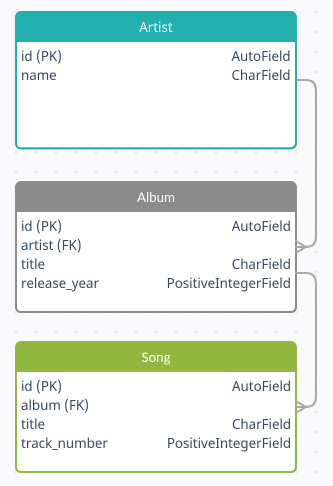
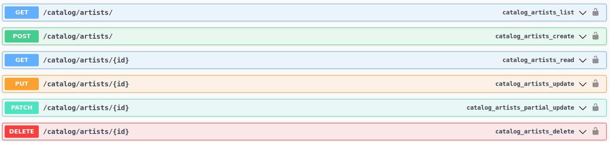
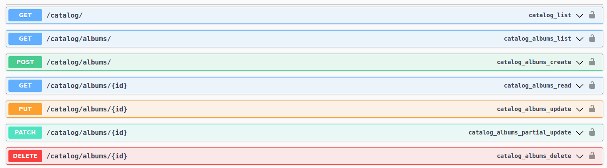
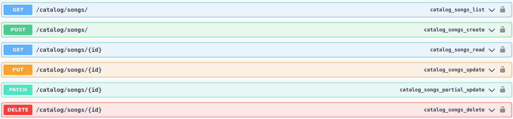

# Api_music_catalog

#### Данный проект представляет собой простой музыкальный каталог, реализованный с помощью Django REST Framework.
___
## Database Schema


___
## Api overview

#### Model Artist:



#### Model Album:




#### Model Song:


___

## Installation

#### Заполните файл .env в соотвествии с образцом по адресу:

```bash
catalog_pr/.env
```

#### Выполните следующую команду:

```bash
docker-compose up 
```

#### Войдите в контейнер приложения:

```bash
docker exec -it api_music_catalog sh
```

#### Выполните миграции:
```bash
python manage.py migrate
```

#### Создайте суперпользователя для доступа в панель администратора:
```bash
python manage.py createsuperuser
```
___

#### Приступайте к использованию!
